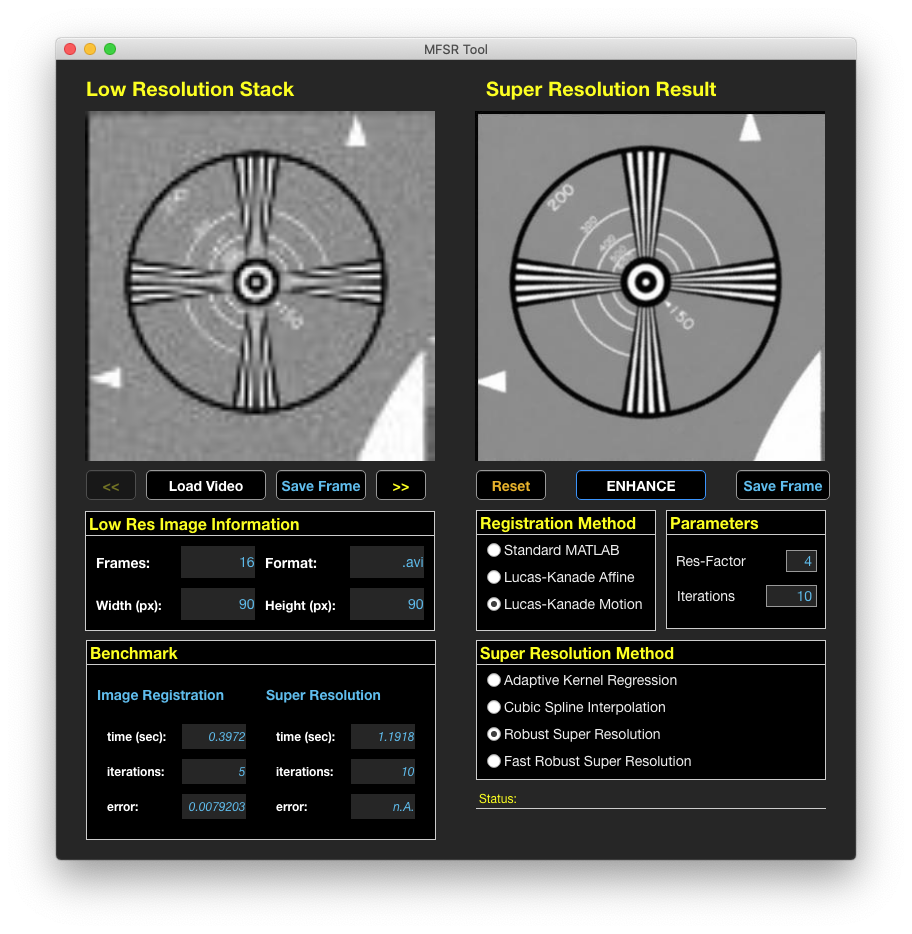

  

 

A Multi Frame Super Resolution Tool for Matlab inspired by the "Robust And Fast Super Resolution" tool by Oded Hanson [Link](http://www1.idc.ac.il/toky/videoProc-07/projects/SuperRes/srproject.html). The App was modified and rebuild with Matlab App-Designer, problems with the "Robust Fast Super Resolution" and the "Lucas-Kannade Affine Optical-Flow" algorithms were fixed. The "MATLAB Image Registration" and "Adaptive Kernel Regression" were added as additional options to compute super resolution.

## Info

This project was realized in the context of a semester project on the topic "Extended studies of Audio and Video Technologies" (AVT) at the TH Köln.

## Features

MFSR Tool to compute an image of higher resolution from a video of low resolution images. Choose from multiple Image-Registration methods and Super-Resolution algorithms. Supported video input formats are AVI, MOV, MP4 and M4V.

Image-Registration methods:

- MATLAB Image Registration
- Lukas-Kanade Optical Flow Affine
- Lucas-Kanade Optical Flow Motion

Super-Resolution Algorithms:

- Adaptive Kernel Regression
- Cubic Spline Interpolation
- Robust Super Resolution
- Fast Robust Super Resolution

## Source Code

The source code is located in `MFSR_App` folder. The App is build with the Matlab App-Designer and compiled with Matlab Application Compiler.

## Standalone Apps

Compiled standalone apps for Windows and OS X are located in `MFSR_Tool` folder. If Matlab (R2019b) isn't installed, use `MFSR_Installer_web` to download the Matlab runtime from web.

## Video Samples

Check `Video_Samples` folder to get some LR video samples to test the different algorithms. Most of them are from

- MDSP Super-Resolution And Demosaicing Datasets [Link](https://users.soe.ucsc.edu/~milanfar/software/sr-datasets.html)

## Sources

Check the `Papers` folder to get more information about the implemented algorithms.

#### Code

- Robust And Fast Super Resolution (by Oded Hanson) [Link](http://www1.idc.ac.il/toky/videoProc-07/projects/SuperRes/srproject.html)
- Video super-resolution by adaptive kernel regression (by Mohammad Moinul Islam) [Link](https://www.mathworks.com/matlabcentral/fileexchange/60766-video-super-resolution-by-adaptive-kernel-regression)
- Intensity-Based Automatic Image Registration (MathWorks) [Link](https://de.mathworks.com/help/images/intensity-based-automatic-image-registration.html)
- Affine optic flow (by David Young) [Link](https://de.mathworks.com/matlabcentral/fileexchange/27093-affine-optic-flow)

#### Papers

- Fast and Robust Multiframe Super Resolution (by Sina Farsiu et al.) [Link](http://people.duke.edu/~sf59/SRfinal.pdf)
- Pyramidal Implementation of the Lucas Kanade Feature Tracker (by Jean-Yves Bouguet) [Link](http://robots.stanford.edu/cs223b04/algo_tracking.pdf)
- Video Super-Resolution by Adaptive Kernel Regression (by Mohammad Moinul Islam et al.) [link](https://link.springer.com/chapter/10.1007/978-3-642-10520-3_76)
